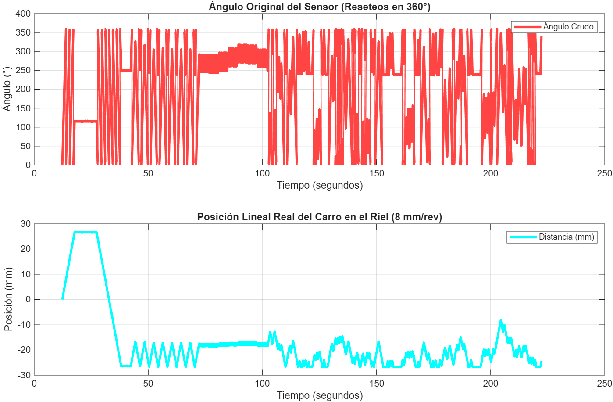
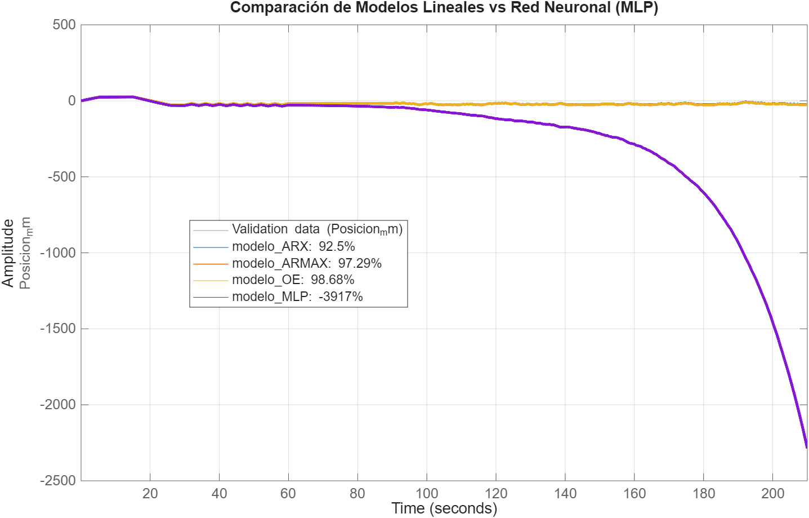
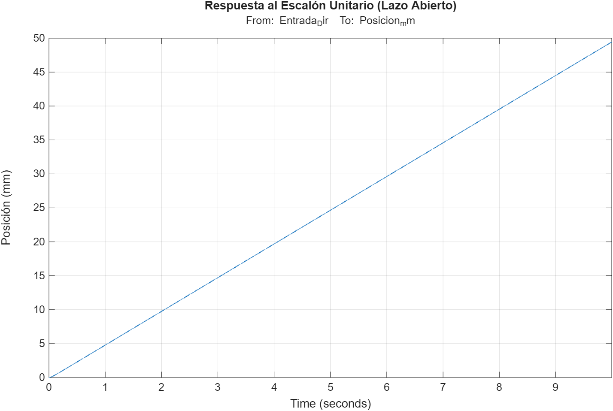

# Fase 1: Identificación de Sistemas y Modelo Cinemático

*Viene de: [Ensamblaje de Hardware](../hardware/)*

Antes de diseñar algoritmos de control de alta precisión (PID, FLC, ANFIS), es estrictamente necesario conocer la dinámica matemática de la planta física. Dado que los motores paso a paso operan bajo fricción no lineal e inercias variables, sintonizar controladores "a ciegas" es ineficiente y riesgoso para la transmisión mecánica. 

Por lo tanto, el objetivo de esta fase es excitar la máquina en lazo abierto, registrar su respuesta y utilizar técnicas de Identificación de Sistemas para obtener la **Función de Transferencia Nominal** de cada eje. Este modelo matemático será la base para la simulación y diseño de los controladores en la siguiente etapa.

>  **IMPORTANTE: ARQUITECTURA AISLADA POR EJE**
> Debido a que cada eje utiliza un sistema de transmisión distinto (Correa GT2, Doble Husillo, Husillo de paso fino), la dinámica varía. Por esta razón, **cada motor tiene su propio código de captura en el ESP32 y su propio script de estimación en MATLAB**. 

---

## 1. Adquisición de Datos (`esp32_data_logging/`)
Contiene los firmwares en C++ ejecutados en el microcontrolador ESP32 para inyectar señales de excitación y recolectar telemetría.

*   **Inyección Pseudoaleatoria:** El código genera un tren de pulsos (STEP/DIR) alternando direcciones y pausas en distintos intervalos de tiempo para revelar la inercia, la fricción estática y el retraso del actuador.
*   **Adquisición:** Registro pasivo de la posición angular usando el encoder AS5600 (I2C) a 50 Hz.
*   **Almacenamiento Local:** El ESP32 levanta un punto de acceso WiFi y un servidor Web, permitiendo iniciar la prueba y descargar el archivo `datos.csv` almacenado en la memoria Flash del microcontrolador.

---

## 2. Estimación del Modelo (`matlab_sys_id/`)
Scripts de MATLAB que procesan el archivo `.csv` descargado, estiman la planta matemática y validan el ajuste.

**Flujo de procesamiento analítico:**
1.  **Acondicionamiento:** Desenvolvimiento de fase (*unwrap*) de los datos crudos del encoder y conversión al dominio espacial métrico (ej. 8 mm/rev para el eje Y).
    

      
      
<i>Transformación de la lectura angular cruda del AS5600 a desplazamiento continuo</i>

    

2.  **Evaluación de Estructuras:** Se evalúan modelos paramétricos (ARX, ARMAX, OE) y redes neuronales (MLP).
3.  **Selección del Modelo OE:** La estructura **Output-Error (OE)** demostró sistemáticamente el mejor ajuste (sobre 98%). Este modelo aísla el ruido de medición del sensor sin distorsionar la naturaleza de "integrador puro" del actuador paso a paso.

  
  
<i>Comparativa de ajuste (Fit) evidenciando la superioridad del modelo Output-Error frente a la dinámica real del motor</i>

### Resultado: Dinámica Obtenida (Modelo Digital)
A modo de ejemplo, tras la ejecución del script para el **Eje Y (Motor NEMA 23)**, el sistema identifica una dinámica de segundo orden que captura la inercia del pórtico y las latencias de conmutación de los optoacopladores. 

La función de transferencia discreta extraída ($T_s = 20,2$ ms) es:

$$G(z) = \frac{0,05286z^{-1} - 0,01891z^{-2}}{1 - 1,6620z^{-1} + 0,6618z^{-2}}$$

  
  
<i>Análisis dinámico en lazo abierto de la planta equivalente identificada (Respuesta temporal del Eje Y)</i>

Posteriormente, el script remuestrea automáticamente este modelo a **1 kHz ($T_s = 1$ ms)** para garantizar que las simulaciones de control coincidan exactamente con la frecuencia de interrupción del ESP32 en tiempo real.

##  Guía de Ejecución (Cómo reproducir la Identificación)

Para replicar la obtención del modelo matemático y generar las matrices LUT 2D, sigue este flujo de trabajo de forma independiente **para cada eje**:

### Paso 1: Captura de Datos en Hardware (ESP32)
1. Abre el código fuente correspondiente al motor que deseas evaluar (ej. `CAPTURA_DATOS_NEMA23_DOS_MOTORES.ino` para el eje Y) en el IDE de Arduino.
2. Instala la librería necesaria `Adafruit INA219` y asegúrate de configurar el particionamiento de memoria de tu placa para soportar el sistema de archivos `LittleFS`.
3. Modifica las variables `ssid` y `password` con las credenciales de tu red WiFi local.
4. Compila y sube el código. Abre el Monitor Serie (a 115200 baudios) para conocer la dirección IP asignada al ESP32.
5. **Calibración mecánica:** Desplaza manualmente el carro del eje correspondiente hasta situarlo **exactamente en el centro** de su riel (para respetar la distancia segura programada).
6. Abre tu navegador web, ingresa la IP del ESP32 y presiona **"INICIAR SECUENCIA"**. La máquina ejecutará movimientos pseudoaleatorios para capturar la dinámica.
7. Al finalizar la rutina, haz clic en **"DESCARGAR CSV"** para obtener tu archivo de telemetría (por defecto, guardado como `datos.csv`).

### Paso 2: Procesamiento y Gemelo Digital (MATLAB)
1. Verifica tener instalados los complementos **System Identification Toolbox** y **Fuzzy Logic Toolbox** en MATLAB.
2. Copia el archivo `datos.csv` descargado del ESP32 en la misma carpeta donde reside el script de análisis **específico para ese motor** (ej. `nema23_v3.m`).
3. Abre el script y verifica que la variable `nombreArchivo` en la línea 8 coincida con el nombre de tu telemetría.
4. Haz clic en **Run**. El script se ejecutará de forma desatendida y realizará lo siguiente:
   * Acondicionamiento de señal y estimación paramétrica.
   * Simulación del modelo digital inyectando fricción y ruido.
   * Entrenamiento de la red ANFIS (500 épocas) clonando al controlador Sugeno.
5. **Resultado final:** Revisa la consola de comandos de MATLAB. El script imprimirá directamente el código en C++ con las matrices bidimensionales `const float` (LUT 21x21) de las superficies de control, listas para ser copiadas en el firmware final del ESP32. Adicionalmente, se generará un archivo `.csv` con los parámetros del consecuente.

## Siguiente Paso: Algoritmos de Control

Con las funciones de transferencia nominales obtenidas para los ejes X, Y y Z, el siguiente paso es utilizar este Gemelo Digital para diseñar, sintonizar y someter a estrés las estrategias PID, Lógica Difusa (FLC) y la Red Neuro-Difusa (ANFIS).

**[Ir a la Fase 2: Diseño y Simulación de Controladores](../2_Simulacion_Controladores/)**
