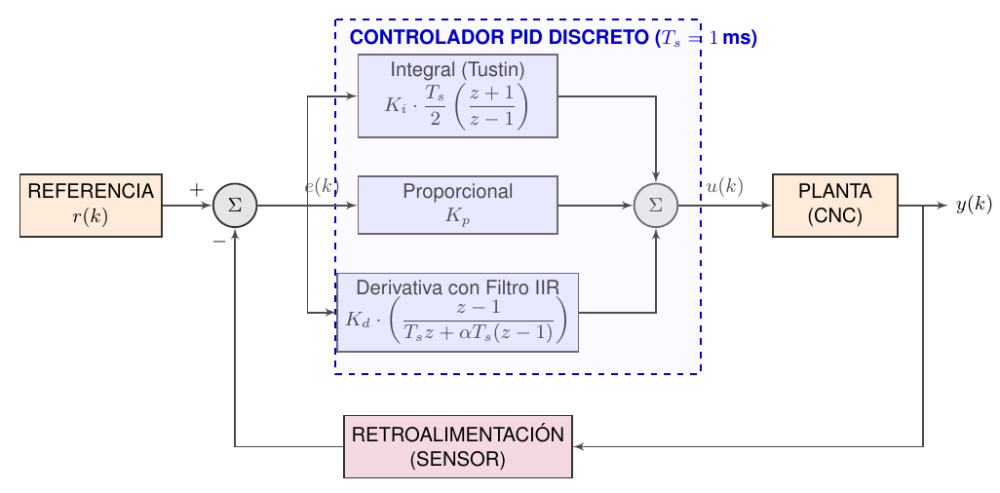
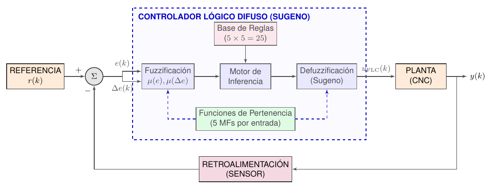
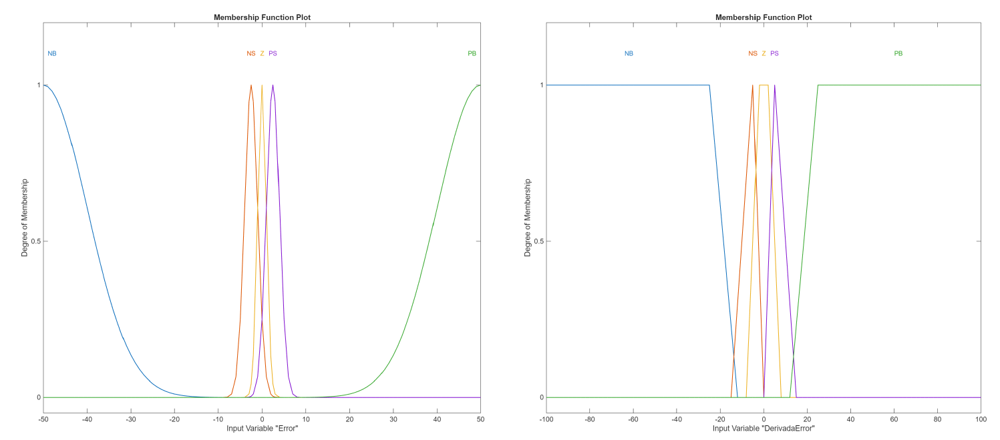
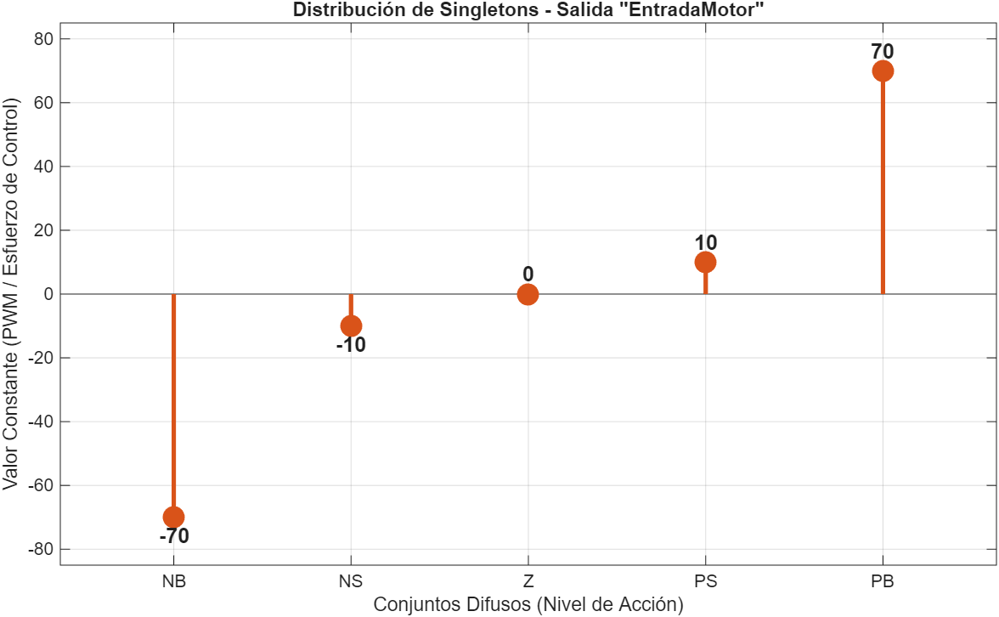
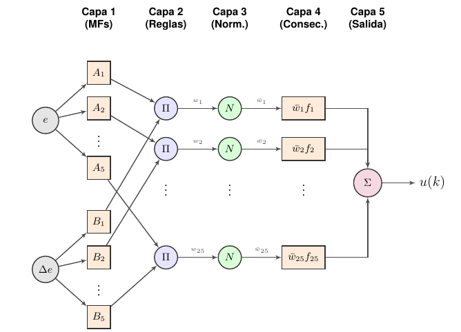
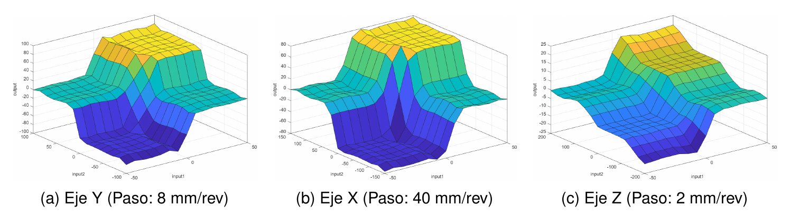

# Fase 2: Diseño y Simulación de Controladores (Modelo Digital)

*Viene de: [Fase 1: Identificación de Sistemas](../1_Identificacion_Sistemas/)*

A partir de las funciones de transferencia obtenidas en la fase previa, esta sección aborda el diseño y validación de los algoritmos de control de posición. La síntesis y el análisis de estabilidad se realizan en un entorno de simulación (Modelo Digital en MATLAB) para evaluar el desempeño de tres estrategias: **PID Discreto, Control Lógico Difuso (FLC) y Sistema de Inferencia Neuro-Difuso Adaptativo (ANFIS)** antes de su implementación física.

---

## Arquitectura de las Leyes de Control

### 1. Controlador Lineal (PID Discreto)
El controlador Proporcional-Integral-Derivativo (PID) se implementó en su topología paralela discreta con un tiempo de muestreo de $T_s = 1$ ms ($1$ kHz). 

Para atenuar la amplificación del ruido de cuantización inherente a los encoders magnéticos, la acción derivativa emplea una aproximación de Euler hacia atrás acoplada a un filtro paso bajo IIR de primer orden ($\alpha$). La acción integral utiliza la aproximación trapezoidal de Tustin e incorpora un método *anti-windup* condicional para mitigar la saturación de la señal de control ante perturbaciones prolongadas.

  
  
<i>Arquitectura en lazo cerrado del controlador PID discreto con filtrado derivativo</i>

### 2. Control Lógico Difuso (FLC Sugeno PD+I)
Como alternativa a las limitaciones del control lineal frente a dinámicas variantes en el tiempo, se diseñó un sistema de inferencia difusa Takagi-Sugeno de orden cero. 

*   **Arquitectura PD+I:** El núcleo difuso evalúa el error de posición ($e$) y la derivada del error ($\Delta e$) actuando como un compensador PD. En paralelo, un integrador lineal compensa el error en régimen permanente.
*   **Base de Reglas:** Se establecieron 5 funciones de pertenencia (NB, NS, Z, PS, PB) para cada entrada, consolidando una base paramétrica de 25 reglas lógicas con salidas constantes (*singletons*).

  
  
<i>Estructura general del Controlador Lógico Difuso Sugeno (PD+I)</i>

A continuación, se presenta la morfología de los conjuntos de entrada y la distribución paramétrica de los *singletons* de salida:

<table align="center">
  <tr>
    <td align="center"></td>
    <td align="center"></td>
  </tr>
  <tr>
    <td align="center"><b>(a) Funciones de pertenencia (Error y Derivada)</b></td>
    <td align="center"><b>(b) Salidas constantes (Singletons)</b></td>
  </tr>
</table>

### 3. Sistema de Inferencia Neuro-Difuso Adaptativo (ANFIS)
Para optimizar la superficie de control obtenida empíricamente, se implementó una red neuronal ANFIS de 5 capas orientada a clonar la heurística del FLC mediante aprendizaje supervisado.

*   El algoritmo ajusta los antecedentes mediante retropropagación del gradiente y los consecuentes mediante estimación por mínimos cuadrados (LSE).
*   Se sustituyeron los conjuntos poligonales del FLC por funciones de campana generalizada (`gbellmf`). Al ser de clase $C^\infty$, estas funciones actúan como un filtro espacial continuo sobre la superficie de control, atenuando transiciones abruptas en la señal de mando.

  
  
<i>Arquitectura topológica de la red neuro-difusa (ANFIS) de 5 capas</i>

---

## Parámetros de Simulación y No Linealidades (MATLAB)

El entorno de simulación evalúa la robustez de los algoritmos mediante la inyección analítica de perturbaciones y no linealidades mecánicas. Para replicar los ensayos, se deben configurar los siguientes parámetros en los scripts `nema17_v4.m`, `nema23_v3_2.m` y `nema11_v3.m`:

1.  **Filtro Derivativo (`alpha = 0.002`):** Establece una frecuencia de corte de $\approx 0.8$ Hz. Este factor de atenuación es crítico a 1 kHz; valores superiores introducen ruido estocástico en la derivada, induciendo oscilaciones de alta frecuencia (*chattering*) que pueden saturar la etapa de potencia.
2.  **No Linealidades (`flags` activas):** 
    *   Fricción de Coulomb y fricción viscosa.
    *   Juego mecánico (Backlash): 0.5 mm en husillos y 0.2 mm en poleas/correas.
    *   Perturbación externa de 20.5 N y ruido blanco gaussiano de medición.
3.  **Restricción de Hardware (`flags.VelMaxFisica`):** Límite dinámico de velocidad impuesto por la cinemática de cada eje. Configurado a `70.0 mm/s` para X/Y y `10.0 mm/s` para el eje Z.

---

## Desempeño Dinámico Multivariable

La exposición de las estrategias a las condiciones de carga descritas generó métricas diferenciadas según la naturaleza cinemática de cada eje:

*   **Controlador PID:** Presentó los mayores tiempos de asentamiento y desviación transitoria, ocasionados por la saturación del término integral frente al roce estático y la incapacidad de la derivada altamente filtrada para predecir discontinuidades.
*   **Controlador FLC Sugeno:** Disminuyó el error geométrico, pero la topología de sus conjuntos de pertenencia amplificó la Variación Total (TV) del esfuerzo de control al interactuar con el ruido estocástico del sensor.
*   **Controlador ANFIS:** Registró el menor Error Cuadrático Medio (RMSE) y estabilizó la respuesta temporal (ej. 0.66 s de tiempo de asentamiento en el eje X). El proceso de entrenamiento optimizó la superficie, lo que se tradujo en una señal de mando con menor dispersión vibratoria en los actuadores mecánicos.

<table align="center">
  <tr>
    <td align="center"></td>
    <td align="center"></td>
  </tr>
  <tr>
    <td align="center"><b>(a) Eje Y (NEMA 23): Respuesta bajo perturbación externa</b></td>
    <td align="center"><b>(b) Eje X (NEMA 17): Estabilización de la transmisión elástica</b></td>
  </tr>
</table>

---

## Discretización y Extracción de Superficies (LUT 2D)

La evaluación iterativa de 25 reglas de inferencia difusa exige una carga computacional que excede el período de interrupción de 1 ms disponible en el microcontrolador ESP32.

Para asegurar determinismo temporal, el script de MATLAB mapea el espacio de estados continuo de las estrategias FLC y ANFIS y lo discretiza en matrices constantes bidimensionales (**Tablas de Búsqueda de 21x21 puntos**). Al finalizar la simulación, el código genera la sintaxis en C++ (ej. `const float matriz_anfis_X[21][21]`). 

La integración de estas matrices en el firmware reduce la complejidad algorítmica de $\mathcal{O}(N)$ a $\mathcal{O}(1)$ mediante una interpolación bilineal que requiere un tiempo de ejecución de procesamiento inferior a $12\,\mu\text{s}$.

  
  
<i>Superficie de control no lineal (LUT 21x21) optimizada por ANFIS</i>

---

## Siguiente Paso: Implementación y Validación en Hardware

Con las tablas de interpolación generadas y las constantes PID definidas, la etapa final contempla la inyección de la lógica en el ESP32 para ejecutar interpolaciones multieje (polígonos y espirales) comprobando empíricamente el error de contorno espacial sobre la plataforma CNC.

**[Ir a la Fase 3: Ejecución en Lazo Cerrado (Hardware)](../3_Ejecucion_Lazo_Cerrado/)**
