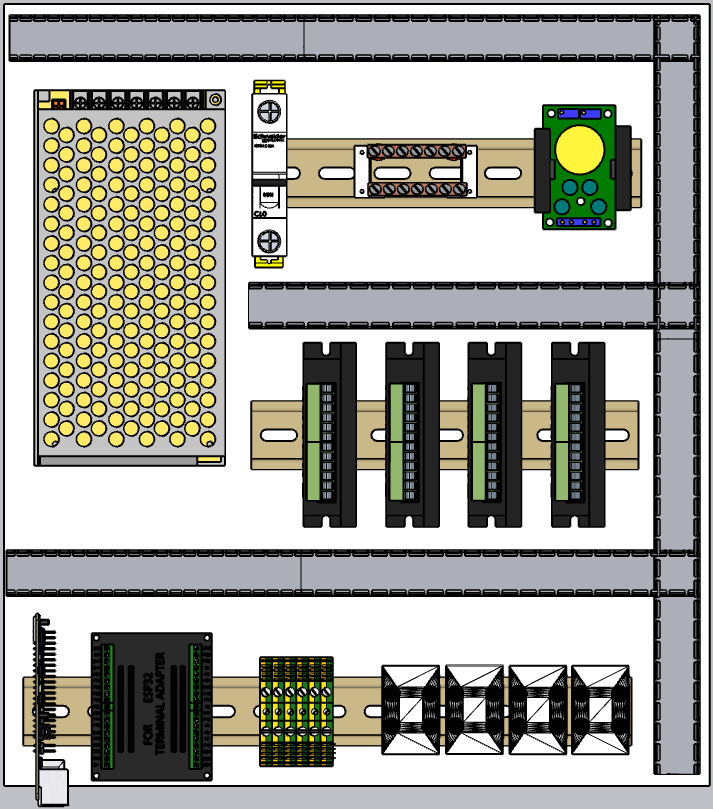
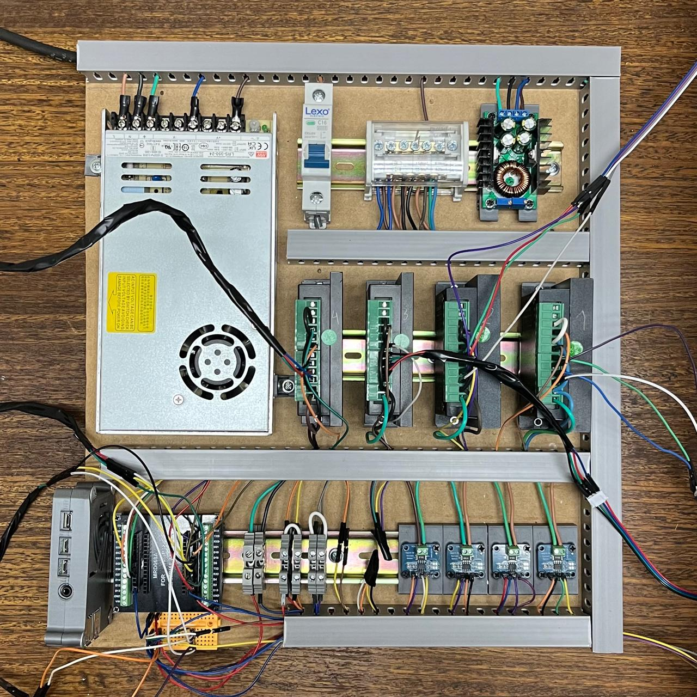
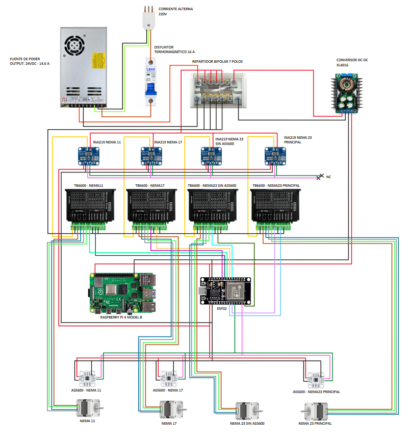

# Tablero Eléctrico y Electrónica de Control

Esta carpeta contiene la documentación, esquemáticos y piezas 3D (`.stl`) relacionadas con el diseño y ensamblaje del tablero eléctrico de la plataforma CNC. El diseño del tablero se centralizó para facilitar el ensamblaje, favorecer la disipación térmica y reducir las interferencias electromagnéticas.

<table align="center">
  <tr>
    <td align="center">
      
    </td>
    <td align="center">
      
    </td>
  </tr>
  <tr>
    <td align="center"><b>(a) Modelo CAD tridimensional</b></td>
    <td align="center"><b>(b) Implementación física real</b></td>
  </tr>
</table>

## Distribución Espacial

La disposición interna aplica una separación espacial entre la etapa de potencia y la etapa de control:
*   **Alta Potencia:** La fuente principal y los controladores de los motores (drivers) se ubican alejados de las placas de bajo voltaje para prevenir que el ruido eléctrico corrompa la transmisión de datos de los encoders.
*   **Bajo Voltaje y Sensores:** Microcontroladores y terminales de los buses de comunicación I2C.
*   **Escalabilidad:** El diseño reserva espacio físico para la futura integración de módulos de medición de consumo (sensores INA219) para investigaciones en mantenimiento predictivo.

## Etapa de Potencia y Alimentación

El sistema de alimentación utiliza un esquema jerárquico para asegurar independencia galvánica[cite: 2]:
*   **Fuente Principal Conmutada (24 VDC / 14,6 A):** Energiza la etapa de tracción (drivers y motores).
*   **Conversor DC-DC Step-Down XL4016:** Reduce la línea principal de 24 V a 5 VDC (hasta 10 A) para alimentar la electrónica lógica.
*   **Nodo Equipotencial:** Se unificaron las líneas de retorno (GND) de la fuente de 24 VDC, el regulador de 5 VDC, el ESP32 y la Raspberry Pi para evitar diferencias de potencial y proteger los optoacopladores.

## Unidades de Procesamiento
*   **Gestión y HMI (Soft Real-Time):** Raspberry Pi 4 Model B (5 VDC).
*   **Lazo de Control (Hard Real-Time):** ESP32 DevKit v1 (5 VDC) ejecutando algoritmos PID, FLC y ANFIS.

## Drivers de Motores (TB6600)

Se utilizan 4 controladores TB6600 seleccionados por su disipación pasiva y aislamiento optoacoplado. Todos operan con una resolución de **1/8 de microstepping (1600 pulsos/rev)** para atenuar resonancias mecánicas y suavizar el movimiento.

**Calibración de Corriente por Actuador:**
*   **Motor 1 (Eje Y1 - NEMA 23):** Fase: 3,0 A | Peak: 3,2 A.
*   **Motor 2 (Eje Y2 - NEMA 23):** Fase: 3,0 A | Peak: 3,2 A.
*   **Motor 3 (Eje X - NEMA 17):** Fase: 1,5 A | Peak: 1,7 A.
*   **Motor 4 (Eje Z - NEMA 11):** Fase: 0,5 A | Peak: 0,7 A.

*Nota de Diseño (Gantry):* Los actuadores del eje Y (Y1 y Y2) no se puentean eléctricamente, sino que utilizan pines GPIO independientes del ESP32 para coordinar la sincronización síncrona por firmware.

##  Diagrama de Conexiones e Integración

El siguiente diagrama esquemático detalla la interconexión completa entre la etapa de control (ESP32 y Raspberry Pi), la etapa de potencia (TB6600) y el sistema de sensórica. 

  
  
<b>Interconexión eléctrica de la plataforma CNC (Actuadores, Drivers y Encoders I2C)</b>

**Consideraciones críticas de ruteo:**
* **Sincronización del Eje Y (Gantry):** Los actuadores Y1 y Y2 utilizan pines GPIO independientes en el ESP32 para asegurar sincronismo por firmware, sin puentear señales.
* **Buses I2C (Direcciones 0x36):** Para evitar colisiones entre los encoders AS5600, se utilizó un mapeo multinivel: I2C_0 (Hardware) para el eje Y, I2C_1 (Hardware) para el eje X, e I2C (Software / Bit-Banging) para el eje Z.

---

## Esquema Electrónico y Asignación de Pines

El tablero de control utiliza una fuente de 24 VDC / 14.6A para la etapa de potencia (Drivers TB6600 ajustados a 1/8 de microstepping = 1600 pul/rev) y un regulador Step-Down XL4016 (5 VDC) para la electrónica lógica.

### Pinout del ESP32 (Microcontrolador de Tiempo Real)

| Subsistema / Actuador | Pin ESP32 | Función Específica |
| :--- | :---: | :--- |
| **Eje X** (NEMA 17) | `GPIO 27` (PUL) / `GPIO 33` (DIR) | Generación de pasos y dirección. |
| **Eje Y1 Principal** (NEMA 23) | `GPIO 2` (PUL) / `GPIO 15` (DIR) | Control de motor primario pórtico. |
| **Eje Y2 Secundario** (NEMA 23) | `GPIO 32` (PUL) / `GPIO 23` (DIR) | Control síncrono del pórtico (Gantry). |
| **Eje Z** (NEMA 11) | `GPIO 25` (PUL) / `GPIO 26` (DIR) | Generación de pasos y dirección. |
| **Sensor Eje Y1** (AS5600) | `GPIO 21` (SDA) / `GPIO 22` (SCL) | I2C Hardware 0 (Bus principal). |
| **Sensor Eje X** (AS5600) | `GPIO 18` (SDA) / `GPIO 19` (SCL) | I2C Hardware 1. |
| **Sensor Eje Z** (AS5600) | `GPIO 4` (SDA) / `GPIO 5` (SCL) | I2C vía Software (Bit-Banging). |

---

## Archivos 3D (STL) en esta carpeta
En este directorio se incluyen los modelos para manufactura aditiva correspondientes a las sujeciones internas del gabinete (ej. rieles DIN en PLA+, soportes para la placa de expansión del ESP32, montajes del conversor DC-DC, etc).
